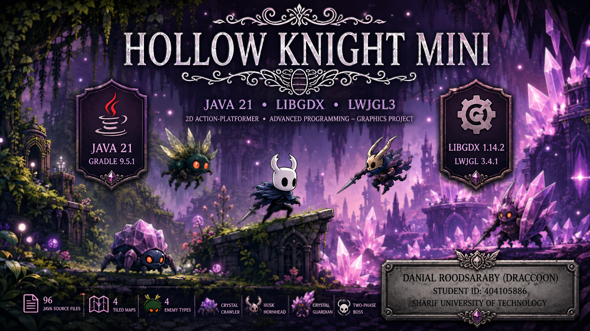
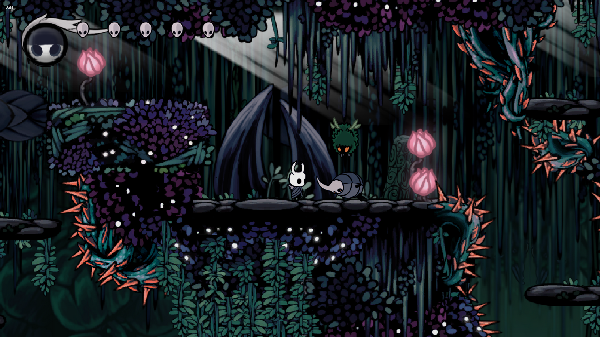
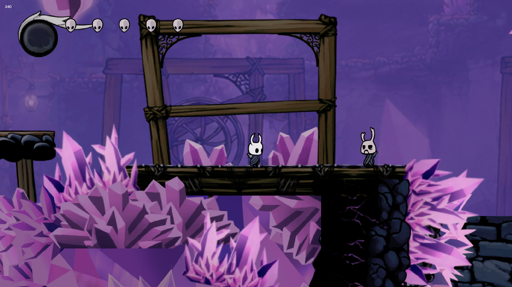
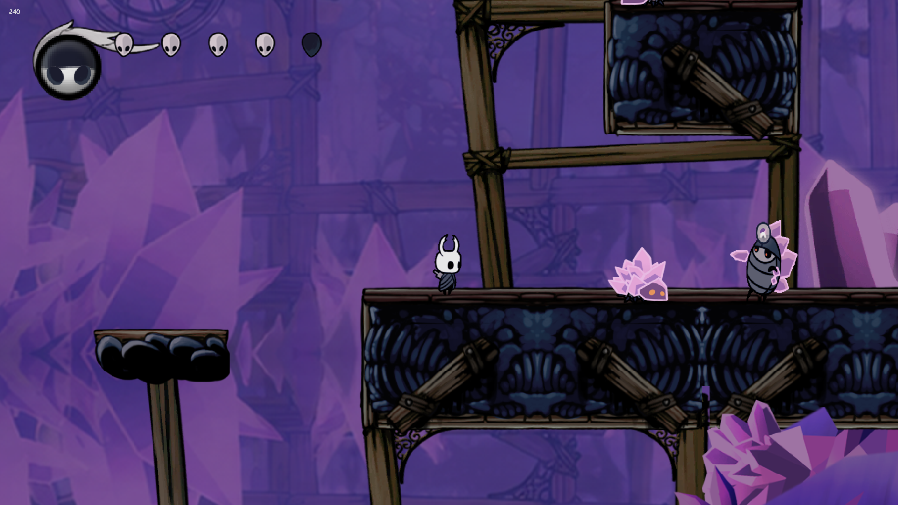
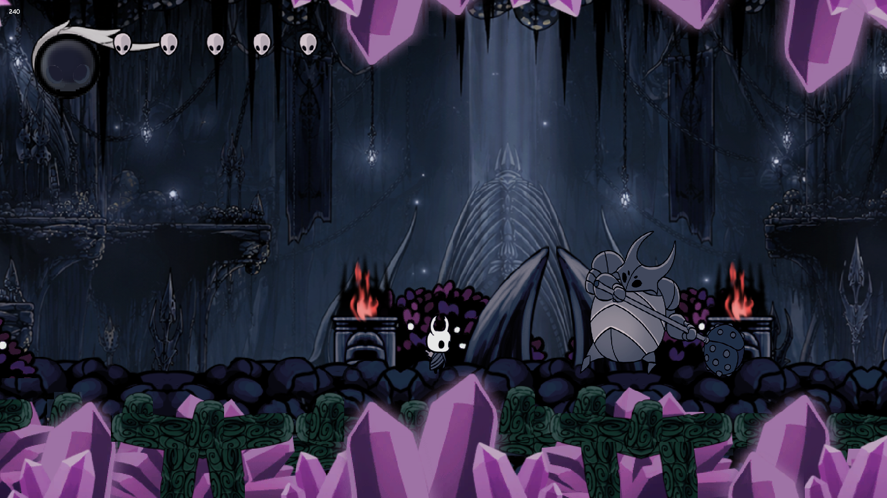

<div align="center">

# Hollow Knight Mini

**A 2D action-platformer built in Java with libGDX — hand-written physics, state-machine enemy AI, and a two-phase boss encounter.**



<br/>

[](https://adoptium.net/)
[](https://libgdx.com/)
[](https://www.lwjgl.org/)
[](https://gradle.org/)
[](#build--run)

<br/>

<a href="https://github.com/danielroods/HollowKnight-mini/releases/latest">
  
</a>

</div>

---

## Overview

**Hollow Knight Mini** is a 2D action-platformer inspired by *Hollow Knight*, written from scratch in **Java 21** on top of the **libGDX** framework and its **LWJGL3** desktop backend. It was developed as an **Advanced Programming — Graphics Project** at **Sharif University of Technology**.

No physics or AI engine is used: gravity, collision resolution, hitboxes, enemy behaviour, camera control and the save system are all implemented directly against libGDX's rendering, input and Tiled primitives — then packaged as a self-contained desktop application.

| | |
| --- | --- |
| **Source** | 96 Java source files (~10,000 lines) across two Gradle modules |
| **World** | 4 Tiled maps — Greenpath (2 rooms), Crystal Peak, Boss Arena |
| **Characters** | 4 enemy types + a two-phase boss + an interactive NPC |
| **Systems** | Combat, spells, charms, achievements, 4-slot saves, settings, audio |
| **Distribution** | Cross-platform runnable JAR and a Windows x64 build with a bundled Java runtime |

---

## Gameplay Video

<div align="center">

[](video.mp4)

**▶ Watch the full gameplay walkthrough (~6 minutes)**

<sub>Opens <code>video.mp4</code> in the repository</sub>

</div>

A complete run: traversal and combat across Greenpath, the Crystal Peak descent with ranged enemies and the Zote encounter, charms and spells in use, and the full two-phase False Knight fight through to the *Journey's End* summary screen.

---

## Screenshots

<div align="center">

<table>
  <tr>
    <td width="50%"></td>
    <td width="50%"></td>
  </tr>
  <tr>
    <td width="50%"></td>
    <td width="50%"></td>
  </tr>
</table>

</div>

---

## Key Features

**Traversal & combat** — running, jumping, double jump, dash with cooldown, wall slide and wall jump; directional nail attacks (forward, up, down) with hitbox timing windows, knockback and post-hit invincibility.

**Soul, spells & charms** — nail hits build Soul, which is spent either on *Focus* to heal a mask or on two spells, *Vengeful Spirit* (piercing projectile) and *Howling Wraiths* (area burst). Six charms are equipped from an in-game inventory within a notch budget, modifying damage, attack and focus speed, dash cooldown, knockback and soul gain.

**Enemies & boss AI** — each character is a distinct state machine:

| Character | Behaviour |
| --- | --- |
| **Mossfly** | Stays hidden, emerges on detection, then homes in on the player |
| **Husk Hornhead** | Patrol/rest cycles with terrain probing, charges on detection |
| **Crystal Crawler** | Terrain-aware ground patrol that turns at walls and ledges |
| **Crystal Guardian** | Telegraphed ranged laser, enraged chase, evasion, return to post |
| **False Knight** | Twelve-state, two-phase boss with distance-weighted random attack selection, a stun window and an escalating second phase |
| **Zote** (NPC) | Typewriter dialogue with voice clips; turns hostile if attacked |

**Progression & presentation** — five achievements persisted between sessions, four save slots with per-area slot cards, animated HUD for masks and Soul, per-area music with crossfades, camera shake and parallax backgrounds, and a full menu suite (main, saves, settings, in-game guide, achievements, pause, inventory, end screen).

---

## Controls

Both arrow keys and the **U / H / J / K** cluster work for directional input, so the game is playable on compact keyboards.

| Action | Key | | Action | Key |
| --- | --- | --- | --- | --- |
| Move left / right | `←` `→` or `H` `K` | | Vengeful Spirit | `Z` |
| Aim up / down | `↑` `↓` or `U` `J` | | Howling Wraiths | `↓`/`J` + `Z` |
| Jump · Double jump · Wall jump | `Space` | | Open inventory | `I` |
| Nail attack | `X` | | Interact / talk · Advance dialogue | `E` · `Enter` |
| Up-slash / down-slash | `↑`/`U` + `X` · `↓`/`J` + `X` | | Quick save | `Ctrl` + `S` |
| Dash | `C` | | Pause | `Esc` |
| Focus — spend Soul to heal | Hold `A` | | Delete a save (slot menu) | `D` while hovering |

The inventory is closed with its on-screen **Close** button.

<details>
<summary><b>Cheat codes</b> (also listed in-game under Guide → Cheats)</summary>

<br/>

| Effect | Key |
| --- | --- |
| God mode | `Ctrl` + `D` |
| Charm master — doubles notches | `Ctrl` + `I` |
| Teleport to the boss arena | `Ctrl` + `A` |
| Emergency heal | `Ctrl` + `E` |
| Spectator (free-fly) mode | `Ctrl` + `N` |
| Refill Soul | `Ctrl` + `L` |

</details>

---

## Technical Architecture

| Module | Responsibility |
| --- | --- |
| `core` | The entire game: models, controllers, renderers, screens, asset loading and persistence. No desktop-specific code. |
| `lwjgl3` | Desktop entry point `Lwjgl3Launcher`, window configuration, `StartupHelper` (macOS JVM restart) and all packaging tasks. |

```
Lwjgl3Launcher ─▶ Main (libGDX Game) ─▶ Assets.load() ─▶ MenuController ─▶ screens
                                                                              │
                              GameScreen ──┬── GameController.update(delta)  ─┘
                                           │     input → player → collisions → enemies → spells
                                           └── render: backgrounds → tiles → entities → foreground → HUD
```

The `core` module is organised in three layers:

- **`model/`** — passive state and rules: player, enemies, NPC, spells, charms, achievements, save data, asset facade and the Tiled map registry.
- **`controller/`** — every mutation: input polling, movement and combat, per-enemy AI controllers, audio crossfading and screen routing.
- **`view/`** — rendering only: `GameScreen` plus one renderer per entity type and Scene2D menu screens.

Collision, hitboxes and enemy behaviour are hand-written against Tiled object layers, which encode collision geometry, hazards, doors and spawn points — so new rooms are authored in Tiled rather than in code.

**On the MVC claim.** The separation is real — models never draw, views never mutate — but this is **not** observer-driven MVC: views are not notified of changes, they pull the current state once per frame, which is the conventional shape for a game loop. Several cross-cutting managers are also static. The accurate description is *an MVC-inspired layered architecture with pull-based rendering*.

---

## Technologies

| Technology | Version | Purpose |
| --- | --- | --- |
| **Java** | 21 | Language and compilation target |
| **libGDX** | 1.14.2 | Rendering, input, audio, Tiled maps, Scene2D UI, JSON |
| **LWJGL** | 3.4.1 | OpenGL / GLFW / OpenAL bindings behind the desktop backend |
| **gdx-freetype** | 1.14.2 | Runtime font generation |
| **Tiled** | TMX / TSX | Level, collision and spawn-point authoring |
| **Gradle (Wrapper)** | 9.5.1 | Multi-module build and packaging |
| **Construo** | 2.1.0 | Native distributions with a bundled Temurin 21 runtime |

---

## Project Structure

```
HollowKnight-mini/
├── assets/                     sprites, audio, Tiled maps, UI skin and fonts
├── core/                       platform-independent game module
│   └── src/main/java/HollowKnight/source/
│       ├── Main.java
│       ├── model/
│       ├── controller/
│       └── view/
├── lwjgl3/                     desktop launcher, icons and packaging
│   └── src/main/java/HollowKnight/source/lwjgl3/Lwjgl3Launcher.java
├── gradle/                     wrapper and pinned Java 21 daemon toolchain
├── build.gradle
├── settings.gradle
├── gradle.properties
├── gradlew / gradlew.bat
└── README.md
```

---

## Build & Run

**Requirements:** JDK 21. The build pins a Java 21 daemon toolchain and applies the Foojay resolver, so Gradle can download a matching JDK; the Gradle Wrapper is committed, so Gradle itself is not needed.

```bash
./gradlew lwjgl3:run              # run from source (use gradlew.bat on Windows)
./gradlew lwjgl3:jar              # runnable JAR  → lwjgl3/build/libs/HollowKnight-1.0.0.jar
./gradlew lwjgl3:packageWinX64    # Windows build → lwjgl3/build/construo/dist/HollowKnight-winX64.zip
```

The `run` task uses `assets/` as its working directory, so saves created this way land in `assets/saves/`; the macOS `-XstartOnFirstThread` flag is applied automatically. Platform-trimmed JARs (`jarWin`, `jarMac`, `jarLinux`) and the other Construo targets (`packageLinuxX64`, `packageMacM1`, `packageMacX64`) are also available.

---

## Download

<div align="center">

<a href="https://github.com/danielroods/HollowKnight-mini/releases/latest">
  
</a>

</div>

| Download | Java required? | How to launch |
| --- | --- | --- |
| **`HollowKnight-winX64.zip`** — Windows x64 | **No**, a Java 21 runtime is bundled | Extract anywhere and run **`HollowKnight.exe`** |
| **`HollowKnight-1.0.0.jar`** — cross-platform | **Yes**, Java 21 or newer | `java -jar HollowKnight-1.0.0.jar` |

Keep the extracted folder intact — the executable loads its runtime and assets from beside it and writes saves into a `saves/` folder in the same directory. The game starts in fullscreen; press `Esc` for the pause menu.

---

## Academic & Engineering Value

- **Object-oriented design at scale** — 96 source files kept navigable by one repeatable per-entity structure, with inheritance used only where it removes duplication.
- **Real-time simulation** — frame-rate-independent integration under an explicit update order, with timers, cooldowns and animation state on a shared delta clock.
- **Applied geometry** — AABB penetration resolution, polygon intersection and probe-based environment queries serving as the entire physics layer.
- **Behaviour modelling and delivery** — deterministic state machines with stochastic, distance-weighted boss decisions, plus a serialisation format and multi-module build that ship the result as a standalone application.

---

## Course Information

| | |
| --- | --- |
| **Course** | Advanced Programming — Graphics Project |
| **University** | Sharif University of Technology |
| **Stack** | Java 21 · libGDX (LWJGL3 desktop backend) |
| **Architecture** | MVC-inspired layered design |

---

## Developer Information

|                | |
|----------------| --- |
| **Name**       | Danial Roodsaraby ( Draccoon ) |
| **Student ID** | 404105886 |
| **GitHub**     | [github.com/danielroods](https://github.com/danielroods) |

---

## License & Attribution

This repository does not currently include a `LICENSE` file, so no license is granted and all rights are reserved by their respective owners.

The project is a non-commercial university assignment created for educational purposes. *Hollow Knight*, along with the visual and audio material that inspired it, is the property of **Team Cherry**.

---
